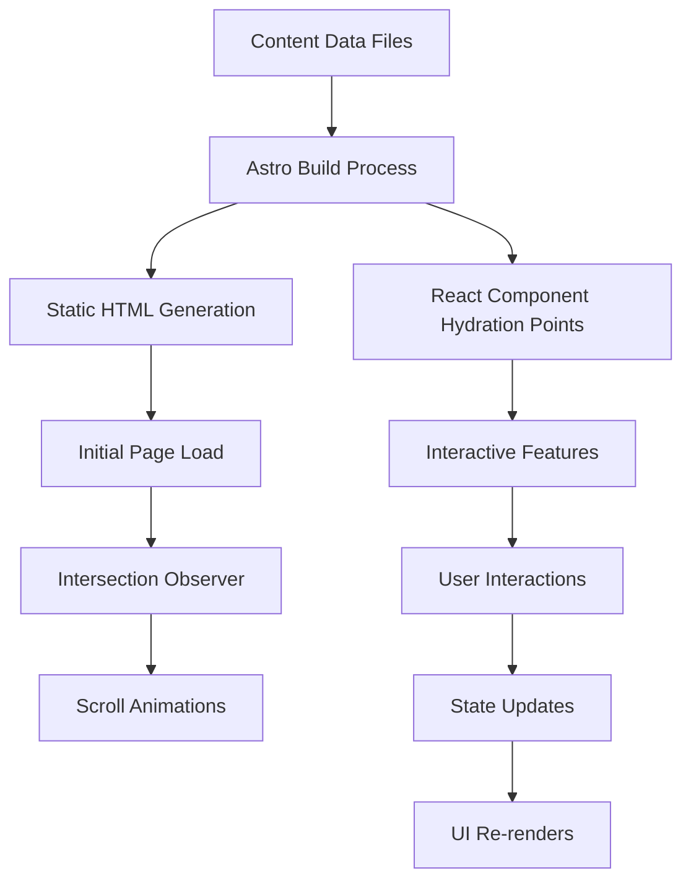

# Design Document: Homepage Apple Design Improvements

## Overview

This design document outlines the comprehensive enhancement of the homepage following Apple's minimalist design philosophy. The implementation focuses on creating a premium, engaging user experience through systematic improvements to typography, spacing, colors, and animations, along with new interactive sections and advanced UX effects.

### Design Goals

- Create a premium, Apple-inspired aesthetic with minimalist design principles
- Improve user engagement through interactive components and smooth animations
- Enhance conversion rates with clear value propositions and trust indicators
- Maintain excellent performance (60fps animations, <3s load time on 3G)
- Ensure WCAG 2.1 Level AA accessibility compliance
- Provide seamless responsive experience across all devices

### Technology Stack

- **Framework**: Astro 5.17+ (static site generation)
- **Styling**: Tailwind CSS 3.4+ with custom design tokens
- **Interactive Components**: React 18.3+ with client-side hydration
- **3D Graphics**: Three.js 0.182+ with React Three Fiber
- **Animation**: CSS transforms, Intersection Observer API, spring physics
- **Build**: Vite with code splitting and lazy loading

## Architecture

### Component Structure

The homepage architecture follows a modular, layered approach:

```
Homepage (index.astro)
├── Design System Layer
│   ├── Typography tokens
│   ├── Spacing scale (8pt grid)
│   ├── Color palette with shades
│   └── Animation configurations
│
├── Static Sections (Astro Components)
│   ├── Hero Section
│   ├── Stats Section
│   ├── Products Section
│   ├── Price Preview
│   ├── Testimonials
│   ├── FAQ Section
│   └── Footer
│
├── Interactive Sections (React Components)
│   ├── Process Timeline
│   ├── Animated Number Counter
│   ├── 3D Product Carousel
│   ├── Before/After Slider
│   ├── Live Metrics Dashboard
│   ├── Trust Badges Carousel
│   ├── Video Testimonials
│   ├── Interactive Map
│   └── Comparison Calculator
│
├── Animation Layer
│   ├── Scroll-triggered animations
│   ├── Parallax effects
│   ├── Magnetic buttons
│   ├── Custom cursor
│   ├── Scroll progress indicator
│   └── Section transitions
│
└── Mobile Enhancements
    ├── Bottom sheet modals
    ├── Touch-optimized elements
    ├── Sticky header with blur
    └── Floating action button
```

### Data Flow



### Performance Strategy

1. **Static Generation**: All non-interactive content pre-rendered at build time
2. **Selective Hydration**: React components hydrated only when needed (client:only, client:visible)
3. **Code Splitting**: Vendor chunks separated (react-vendor, three-vendor)
4. **Lazy Loading**: Images and videos below fold loaded on demand
5. **Asset Optimization**: WebP/AVIF images, minified CSS/JS, tree-shaking

## Design System Specifications

### Typography System

The typography system creates clear visual hierarchy using system fonts that closely match Apple SF Pro.

#### Font Stack

```css
font-family: -apple-system, BlinkMacSystemFont, 'Segoe UI', 'Roboto', 
             'Helvetica Neue', Arial, sans-serif;
```

#### Font Weights

```javascript
fontWeight: {
  thin: 100,
  extralight: 200,
  light: 300,
  normal: 400,
  medium: 500,
  semibold: 600,
  bold: 700,
  extrabold: 800
}
```

#### Type Scale

```javascript
fontSize: {
  xs: ['0.75rem', { lineHeight: '1rem', letterSpacing: '0.05em' }],      // 12px
  sm: ['0.875rem', { lineHeight: '1.25rem', letterSpacing: '0.025em' }], // 14px
  base: ['1rem', { lineHeight: '1.5rem', letterSpacing: '0' }],          // 16px
  lg: ['1.125rem', { lineHeight: '1.75rem', letterSpacing: '-0.01em' }], // 18px
  xl: ['1.25rem', { lineHeight: '1.75rem', letterSpacing: '-0.01em' }],  // 20px
  '2xl': ['1.5rem', { lineHeight: '2rem', letterSpacing: '-0.02em' }],   // 24px
  '3xl': ['1.875rem', { lineHeight: '2.25rem', letterSpacing: '-0.02em' }], // 30px
  '4xl': ['2.25rem', { lineHeight: '2.5rem', letterSpacing: '-0.03em' }],   // 36px
  '5xl': ['3rem', { lineHeight: '1.2', letterSpacing: '-0.04em' }],         // 48px
  '6xl': ['3.75rem', { lineHeight: '1.1', letterSpacing: '-0.04em' }],      // 60px
  '7xl': ['4.5rem', { lineHeight: '1.1', letterSpacing: '-0.05em' }],       // 72px
  '8xl': ['6rem', { lineHeight: '1.1', letterSpacing: '-0.05em' }]          // 96px
}
```

#### Typography Usage Guidelines

- **Hero Headlines**: 5xl-8xl, font-weight: 700-800, tight letter-spacing
- **Section Titles**: 4xl-6xl, font-weight: 600-700, tracking-tight
- **Subsections**: 2xl-3xl, font-weight: 600, normal tracking
- **Body Text**: base-lg, font-weight: 400, normal line-height (1.5-1.75)
- **Captions**: sm-xs, font-weight: 500, increased letter-spacing

### Spacing System (8pt Grid)

All spacing values are multiples of 8px for consistent rhythm and alignment.

```javascript
spacing: {
  0: '0px',
  1: '8px',      // 0.5rem
  2: '16px',     // 1rem
  3: '24px',     // 1.5rem
  4: '32px',     // 2rem
  5: '40px',     // 2.5rem
  6: '48px',     // 3rem
  7: '56px',     // 3.5rem
  8: '64px',     // 4rem
  10: '80px',    // 5rem
  12: '96px',    // 6rem
  16: '128px',   // 8rem
  20: '160px',   // 10rem
  24: '192px',   // 12rem
  32: '256px'    // 16rem
}
```

#### Spacing Application

- **Component Padding**: 4-8 (32-64px)
- **Section Vertical Spacing**: 16-32 (128-256px)
- **Element Gaps**: 2-6 (16-48px)
- **Card Padding**: 6-8 (48-64px)
- **Button Padding**: 3-5 horizontal, 2-3 vertical

### Color System

#### Primary Palette

```javascript
colors: {
  primary: {
    50: '#eff6ff',
    100: '#dbeafe',
    200: '#bfdbfe',
    300: '#93c5fd',
    400: '#60a5fa',
    500: '#3b82f6',  // Base blue
    600: '#175ead',  // Brand primary
    700: '#145a9d',
    800: '#1e40af',
    900: '#1e3a8a'
  }
}
```

#### Neutral Grays

```javascript
gray: {
  50: '#f9fafb',
  100: '#f3f4f6',
  200: '#e5e7eb',
  300: '#d1d5db',
  400: '#9ca3af',
  500: '#6b7280',
  600: '#4b5563',
  700: '#374151',
  800: '#1f2937',
  900: '#111827'
}
```

#### Accent Colors

```javascript
accent: {
  green: {
    500: '#10b981',
    600: '#059669'
  },
  orange: {
    500: '#f59e0b',
    600: '#d97706'
  },
  purple: {
    500: '#8b5cf6',
    600: '#7c3aed'
  },
  red: {
    500: '#ef4444',
    600: '#dc2626'
  }
}
```

#### Shadow Elevation Levels

```javascript
boxShadow: {
  sm: '0 1px 2px 0 rgba(0, 0, 0, 0.05)',
  DEFAULT: '0 1px 3px 0 rgba(0, 0, 0, 0.1), 0 1px 2px 0 rgba(0, 0, 0, 0.06)',
  md: '0 4px 6px -1px rgba(0, 0, 0, 0.1), 0 2px 4px -1px rgba(0, 0, 0, 0.06)',
  lg: '0 10px 15px -3px rgba(0, 0, 0, 0.1), 0 4px 6px -2px rgba(0, 0, 0, 0.05)',
  xl: '0 20px 25px -5px rgba(0, 0, 0, 0.1), 0 10px 10px -5px rgba(0, 0, 0, 0.04)',
  '2xl': '0 25px 50px -12px rgba(0, 0, 0, 0.25)',
  inner: 'inset 0 2px 4px 0 rgba(0, 0, 0, 0.06)'
}
```

#### Glassmorphism Effect

```css
.glass {
  background: rgba(255, 255, 255, 0.8);
  backdrop-filter: blur(12px);
  -webkit-backdrop-filter: blur(12px);
  border: 1px solid rgba(255, 255, 255, 0.3);
}

.glass-dark {
  background: rgba(0, 0, 0, 0.4);
  backdrop-filter: blur(12px);
  -webkit-backdrop-filter: blur(12px);
  border: 1px solid rgba(255, 255, 255, 0.1);
}
```

### Animation System

#### Easing Functions

```javascript
transitionTimingFunction: {
  'expo-out': 'cubic-bezier(0.19, 1, 0.22, 1)',
  'circ-out': 'cubic-bezier(0, 0.55, 0.45, 1)',
  'spring': 'cubic-bezier(0.68, -0.55, 0.265, 1.55)',
  'smooth': 'cubic-bezier(0.4, 0, 0.2, 1)',
  'apple': 'cubic-bezier(0.25, 0.1, 0.25, 1)'
}
```

#### Duration Scale

```javascript
transitionDuration: {
  fast: '150ms',
  normal: '300ms',
  slow: '500ms',
  slower: '700ms',
  slowest: '1000ms'
}
```

#### Stagger Delays

```javascript
animationDelay: {
  50: '50ms',
  100: '100ms',
  150: '150ms',
  200: '200ms',
  300: '300ms',
  500: '500ms'
}
```

#### Spring Animation Configuration

For physics-based animations using spring dynamics:

```javascript
springConfig: {
  gentle: { stiffness: 120, damping: 14 },
  default: { stiffness: 170, damping: 26 },
  wobbly: { stiffness: 180, damping: 12 },
  stiff: { stiffness: 210, damping: 20 },
  slow: { stiffness: 280, damping: 60 }
}
```

#### Entrance Animations

```css
@keyframes fadeIn {
  from { opacity: 0; }
  to { opacity: 1; }
}

@keyframes slideUp {
  from { 
    opacity: 0;
    transform: translateY(30px);
  }
  to { 
    opacity: 1;
    transform: translateY(0);
  }
}

@keyframes slideDown {
  from { 
    opacity: 0;
    transform: translateY(-30px);
  }
  to { 
    opacity: 1;
    transform: translateY(0);
  }
}

@keyframes scaleIn {
  from { 
    opacity: 0;
    transform: scale(0.9);
  }
  to { 
    opacity: 1;
    transform: scale(1);
  }
}

@keyframes rotateIn {
  from { 
    opacity: 0;
    transform: rotate(-5deg) scale(0.95);
  }
  to { 
    opacity: 1;
    transform: rotate(0) scale(1);
  }
}
```

## Components and Interfaces

### 1. Process Timeline Section

**Purpose**: Display the company's 6-step process in an engaging, scrollable timeline.

**Component Structure**:
```typescript
interface ProcessStep {
  number: number;
  title: string;
  description: string;
  icon: string; // SVG icon or emoji
}

interface ProcessTimelineProps {
  steps: ProcessStep[];
}
```

**Desktop Layout**:
- Horizontal scrolling container with snap points
- Each step card: 320px width, 400px height
- Cards arranged in a row with 24px gap
- Scroll indicator showing current position

**Mobile Layout**:
- Vertical stack layout
- Full-width cards with 16px gap
- No horizontal scrolling

**Animation**:
- Fade + slide up on viewport entry
- Stagger delay: 100ms between steps
- Intersection Observer threshold: 0.2

**Styling**:
```css
.process-card {
  background: white;
  border-radius: 24px;
  padding: 48px 32px;
  box-shadow: 0 4px 6px rgba(0, 0, 0, 0.1);
  transition: all 300ms cubic-bezier(0.4, 0, 0.2, 1);
}

.process-card:hover {
  transform: translateY(-8px);
  box-shadow: 0 20px 25px rgba(0, 0, 0, 0.15);
}
```

### 2. Animated Number Counter

**Purpose**: Display key metrics with animated count-up effect when entering viewport.

**Component Structure**:
```typescript
interface CounterMetric {
  value: number;
  label: string;
  suffix?: string;
  prefix?: string;
  icon?: string;
  trend?: 'up' | 'down' | 'neutral';
}

interface AnimatedCounterProps {
  metrics: CounterMetric[];
  duration?: number; // default: 2000ms
}
```

**Animation Logic**:
```typescript
function animateValue(start: number, end: number, duration: number) {
  const startTime = performance.now();
  const easing = (t: number) => t < 0.5 
    ? 4 * t * t * t 
    : (t - 1) * (2 * t - 2) * (2 * t - 2) + 1;
  
  function update(currentTime: number) {
    const elapsed = currentTime - startTime;
    const progress = Math.min(elapsed / duration, 1);
    const easedProgress = easing(progress);
    const current = Math.floor(start + (end - start) * easedProgress);
    
    if (progress < 1) {
      requestAnimationFrame(update);
    }
    return current;
  }
  
  requestAnimationFrame(update);
}
```

**Trigger**: Intersection Observer with threshold 0.5, trigger once

### 3. Product Showcase 3D Carousel

**Purpose**: Interactive 3D carousel for product exploration with depth and perspective.

**Component Structure**:
```typescript
interface Product {
  id: string;
  name: string;
  image: string;
  description: string;
  features: string[];
}

interface Carousel3DProps {
  products: Product[];
  autoRotateInterval?: number; // default: 5000ms
}
```

**3D Transform Configuration**:
```css
.carousel-container {
  perspective: 1200px;
  perspective-origin: 50% 50%;
}

.carousel-track {
  transform-style: preserve-3d;
  transition: transform 700ms cubic-bezier(0.19, 1, 0.22, 1);
}

.carousel-item {
  transform-style: preserve-3d;
  backface-visibility: hidden;
}

/* Center item (active) */
.carousel-item.active {
  transform: translateZ(0) scale(1.1);
  z-index: 10;
  opacity: 1;
}

/* Adjacent items */
.carousel-item.adjacent {
  transform: translateZ(-100px) scale(0.9);
  opacity: 0.7;
}

/* Far items */
.carousel-item.far {
  transform: translateZ(-200px) scale(0.7);
  opacity: 0.4;
}
```

**Interaction**:
- Click/tap navigation buttons
- Swipe gestures on mobile (threshold: 50px)
- Keyboard navigation (arrow keys)
- Auto-rotate after 5s inactivity

### 4. Before/After Comparison Slider

**Purpose**: Interactive slider to compare before/after images.

**Component Structure**:
```typescript
interface ComparisonSliderProps {
  beforeImage: string;
  afterImage: string;
  beforeLabel?: string;
  afterLabel?: string;
  defaultPosition?: number; // 0-100, default: 50
}
```

**Implementation**:
```typescript
function ComparisonSlider({ beforeImage, afterImage, defaultPosition = 50 }) {
  const [position, setPosition] = useState(defaultPosition);
  const [isDragging, setIsDragging] = useState(false);
  const containerRef = useRef<HTMLDivElement>(null);
  
  const handleMove = (clientX: number) => {
    if (!containerRef.current) return;
    const rect = containerRef.current.getBoundingClientRect();
    const x = clientX - rect.left;
    const percentage = (x / rect.width) * 100;
    setPosition(Math.max(0, Math.min(100, percentage)));
  };
  
  // Mouse and touch event handlers
  // ...
}
```

**Styling**:
```css
.comparison-container {
  position: relative;
  overflow: hidden;
  user-select: none;
}

.comparison-after {
  position: absolute;
  top: 0;
  left: 0;
  width: 100%;
  height: 100%;
  clip-path: inset(0 0 0 var(--position));
}

.comparison-handle {
  position: absolute;
  top: 0;
  left: var(--position);
  width: 4px;
  height: 100%;
  background: white;
  cursor: ew-resize;
  box-shadow: 0 0 10px rgba(0, 0, 0, 0.5);
}
```

### 5. Live Metrics Dashboard

**Purpose**: Display real-time or recent metrics with trend indicators.

**Component Structure**:
```typescript
interface Metric {
  id: string;
  label: string;
  value: number;
  unit: string;
  trend: 'up' | 'down' | 'neutral';
  trendValue: number;
  sparklineData?: number[];
}

interface LiveMetricsDashboardProps {
  metrics: Metric[];
  updateInterval?: number; // default: 5000ms
}
```

**Update Logic**:
```typescript
useEffect(() => {
  const interval = setInterval(() => {
    // Fetch new data or simulate updates
    fetchMetrics().then(newMetrics => {
      setMetrics(prevMetrics => 
        prevMetrics.map((metric, index) => ({
          ...metric,
          value: newMetrics[index].value,
          trend: calculateTrend(metric.value, newMetrics[index].value)
        }))
      );
    });
  }, updateInterval);
  
  return () => clearInterval(interval);
}, [updateInterval]);
```

**Sparkline Chart**:
- Mini line chart showing trend over time
- SVG path with smooth curves
- 60px width × 24px height
- Gradient fill under line

### 6. Trust Badges Carousel

**Purpose**: Infinite auto-scrolling carousel of partner logos and certifications.

**Component Structure**:
```typescript
interface TrustBadge {
  id: string;
  name: string;
  logo: string;
  type: 'partner' | 'certification';
}

interface TrustBadgesCarouselProps {
  badges: TrustBadge[];
  speed?: number; // pixels per second, default: 50
}
```

**Infinite Scroll Implementation**:
```typescript
// Duplicate badges array for seamless loop
const duplicatedBadges = [...badges, ...badges];

// CSS animation for continuous scroll
@keyframes scroll {
  0% { transform: translateX(0); }
  100% { transform: translateX(-50%); }
}

.badges-track {
  animation: scroll var(--duration) linear infinite;
}

.badges-track:hover {
  animation-play-state: paused;
}
```

**Styling**:
- Grayscale filter by default
- Color on hover
- Smooth transition: 300ms

### 7. Video Testimonials Section

**Purpose**: Display customer video testimonials with custom player controls.

**Component Structure**:
```typescript
interface VideoTestimonial {
  id: string;
  videoUrl: string;
  posterImage: string;
  customerName: string;
  role: string;
  company: string;
  duration: number; // seconds
}

interface VideoTestimonialsProps {
  testimonials: VideoTestimonial[];
}
```

**Video Player Features**:
- Custom controls overlay
- Play/pause toggle
- Progress bar with scrubbing
- Volume control
- Fullscreen toggle
- Keyboard shortcuts (space, arrows, f)

**Modal/Inline Toggle**:
- Mobile: Inline player with bottom sheet for details
- Desktop: Modal overlay with backdrop blur

### 8. Interactive Map Section

**Purpose**: Display factory location on interactive map with marker popup.

**Component Structure**:
```typescript
interface MapLocation {
  lat: number;
  lng: number;
  name: string;
  address: string;
  phone: string;
  photo?: string;
}

interface InteractiveMapProps {
  location: MapLocation;
  zoom?: number; // default: 15
  fallbackImage?: string;
}
```

**Map Library**: Leaflet.js (lightweight, 39KB gzipped)

**Implementation**:
```typescript
import { MapContainer, TileLayer, Marker, Popup } from 'react-leaflet';

function InteractiveMap({ location, zoom = 15, fallbackImage }) {
  const [mapLoaded, setMapLoaded] = useState(false);
  
  return (
    <div className="map-container">
      {!mapLoaded && fallbackImage && (
        
      )}
      <MapContainer
        center={[location.lat, location.lng]}
        zoom={zoom}
        whenReady={() => setMapLoaded(true)}
      >
        <TileLayer url="https://{s}.tile.openstreetmap.org/{z}/{x}/{y}.png" />
        <Marker position={[location.lat, location.lng]}>
          <Popup>
            <div className="map-popup">
              {location.photo && }
              <h3>{location.name}</h3>
              <p>{location.address}</p>
              <a href={`tel:${location.phone}`}>{location.phone}</a>
            </div>
          </Popup>
        </Marker>
      </MapContainer>
    </div>
  );
}
```

### 9. Comparison Calculator

**Purpose**: Interactive calculator for price/value comparison.

**Component Structure**:
```typescript
interface CalculatorInput {
  id: string;
  label: string;
  type: 'number' | 'select' | 'range';
  min?: number;
  max?: number;
  step?: number;
  options?: { value: string; label: string }[];
  defaultValue: number | string;
}

interface ComparisonOption {
  id: string;
  name: string;
  basePrice: number;
  features: string[];
  recommended?: boolean;
}

interface ComparisonCalculatorProps {
  inputs: CalculatorInput[];
  options: ComparisonOption[];
  calculatePrice: (inputs: Record<string, number | string>, option: ComparisonOption) => number;
}
```

**Real-time Calculation**:
```typescript
const [inputValues, setInputValues] = useState<Record<string, number | string>>({});
const [results, setResults] = useState<Record<string, number>>({});

useEffect(() => {
  const newResults = options.reduce((acc, option) => {
    acc[option.id] = calculatePrice(inputValues, option);
    return acc;
  }, {} as Record<string, number>);
  setResults(newResults);
}, [inputValues, options, calculatePrice]);
```

**Validation**:
- Min/max constraints
- Step increments
- Error messages for invalid inputs
- Disable calculate button until valid

## Data Models

### Content Data Structure

All section content is stored in TypeScript data files for easy management.

**File**: `src/data/homepage-content.ts`

```typescript
export interface HomepageContent {
  hero: HeroSection;
  stats: StatSection;
  processTimeline: ProcessTimelineSection;
  products: ProductSection;
  testimonials: TestimonialSection;
  metrics: MetricsSection;
  trustBadges: TrustBadgesSection;
  map: MapSection;
  calculator: CalculatorSection;
  faq: FAQSection;
}

interface HeroSection {
  badge: {
    icon: string;
    text: string;
  };
  headline: string;
  subheadline: string;
  benefits: string[];
  cta: {
    primary: { text: string; href: string };
    secondary: { text: string; href: string };
  };
  trustIndicators: TrustIndicator[];
}

interface TrustIndicator {
  icon: string;
  value: string;
  label: string;
  gradient: string;
}

interface ProcessTimelineSection {
  title: string;
  subtitle: string;
  steps: ProcessStep[];
}

interface ProcessStep {
  number: number;
  title: string;
  description: string;
  icon: string;
}

// ... additional interfaces for other sections
```

### Design Token Configuration

**File**: `tailwind.config.extended.mjs`

```javascript
export default {
  theme: {
    extend: {
      colors: {
        primary: {
          50: '#eff6ff',
          // ... full palette
        },
        // ... other color scales
      },
      spacing: {
        // 8pt grid values
      },
      fontSize: {
        // Type scale with line-height and letter-spacing
      },
      fontWeight: {
        // Weight scale
      },
      boxShadow: {
        // Elevation levels
      },
      transitionTimingFunction: {
        // Easing functions
      },
      transitionDuration: {
        // Duration scale
      },
      animation: {
        'blob': 'blob 7s infinite',
        'float': 'float 6s ease-in-out infinite',
        'slide-up': 'slideUp 0.5s ease-out',
        'fade-in': 'fadeIn 0.3s ease-out',
      },
      keyframes: {
        blob: {
          '0%': { transform: 'translate(0px, 0px) scale(1)' },
          '33%': { transform: 'translate(30px, -50px) scale(1.1)' },
          '66%': { transform: 'translate(-20px, 20px) scale(0.9)' },
          '100%': { transform: 'translate(0px, 0px) scale(1)' },
        },
        // ... other keyframes
      },
    },
  },
  plugins: [],
}
```


## Animation Specifications

### Scroll-Triggered Animations

**Implementation**: Intersection Observer API for performance

```typescript
const observerOptions = {
  root: null,
  rootMargin: '0px',
  threshold: 0.2 // Trigger when 20% visible
};

const observer = new IntersectionObserver((entries) => {
  entries.forEach(entry => {
    if (entry.isIntersecting) {
      entry.target.classList.add('animate-in');
      observer.unobserve(entry.target); // Trigger once
    }
  });
}, observerOptions);

// Observe all elements with .scroll-reveal class
document.querySelectorAll('.scroll-reveal').forEach(el => {
  observer.observe(el);
});
```

**Animation Classes**:
```css
.scroll-reveal {
  opacity: 0;
  transform: translateY(30px);
  transition: opacity 0.6s cubic-bezier(0.19, 1, 0.22, 1),
              transform 0.6s cubic-bezier(0.19, 1, 0.22, 1);
}

.scroll-reveal.animate-in {
  opacity: 1;
  transform: translateY(0);
}

/* Stagger children */
.stagger-children > * {
  opacity: 0;
  transform: translateY(20px);
}

.stagger-children.animate-in > *:nth-child(1) { animation: slideUp 0.5s ease-out 0.1s forwards; }
.stagger-children.animate-in > *:nth-child(2) { animation: slideUp 0.5s ease-out 0.2s forwards; }
.stagger-children.animate-in > *:nth-child(3) { animation: slideUp 0.5s ease-out 0.3s forwards; }
/* ... continue for more children */
```

### Parallax Effects

**Scroll Parallax**:
```typescript
function initScrollParallax() {
  const parallaxElements = document.querySelectorAll('[data-parallax]');
  
  window.addEventListener('scroll', () => {
    const scrolled = window.pageYOffset;
    
    parallaxElements.forEach(el => {
      const speed = parseFloat(el.getAttribute('data-parallax') || '0.5');
      const yPos = -(scrolled * speed);
      el.style.transform = `translate3d(0, ${yPos}px, 0)`;
    });
  }, { passive: true });
}
```

**Mouse-Move Parallax** (Hero Section):
```typescript
function initMouseParallax() {
  const hero = document.querySelector('#hero-section');
  const layers = hero.querySelectorAll('[data-depth]');
  
  hero.addEventListener('mousemove', (e) => {
    const { clientX, clientY } = e;
    const { width, height } = hero.getBoundingClientRect();
    
    const xPercent = (clientX / width - 0.5) * 2;
    const yPercent = (clientY / height - 0.5) * 2;
    
    layers.forEach(layer => {
      const depth = parseFloat(layer.getAttribute('data-depth') || '1');
      const xMove = xPercent * depth * 20;
      const yMove = yPercent * depth * 20;
      
      layer.style.transform = `translate3d(${xMove}px, ${yMove}px, 0)`;
    });
  });
}
```


### Magnetic Buttons

**Implementation**:
```typescript
function initMagneticButtons() {
  const buttons = document.querySelectorAll('.magnetic-button');
  
  buttons.forEach(button => {
    const attractionRadius = 100; // pixels
    
    document.addEventListener('mousemove', (e) => {
      const rect = button.getBoundingClientRect();
      const centerX = rect.left + rect.width / 2;
      const centerY = rect.top + rect.height / 2;
      
      const distanceX = e.clientX - centerX;
      const distanceY = e.clientY - centerY;
      const distance = Math.sqrt(distanceX ** 2 + distanceY ** 2);
      
      if (distance < attractionRadius) {
        const strength = 1 - (distance / attractionRadius);
        const moveX = distanceX * strength * 0.3;
        const moveY = distanceY * strength * 0.3;
        
        button.style.transform = `translate(${moveX}px, ${moveY}px)`;
      } else {
        button.style.transform = 'translate(0, 0)';
      }
    });
  });
}
```

**CSS**:
```css
.magnetic-button {
  transition: transform 0.3s cubic-bezier(0.68, -0.55, 0.265, 1.55);
  will-change: transform;
}
```

### Custom Cursor Effects

**Implementation**:
```typescript
function initCustomCursor() {
  const cursor = document.createElement('div');
  cursor.className = 'custom-cursor';
  document.body.appendChild(cursor);
  
  let mouseX = 0, mouseY = 0;
  let cursorX = 0, cursorY = 0;
  
  document.addEventListener('mousemove', (e) => {
    mouseX = e.clientX;
    mouseY = e.clientY;
  });
  
  // Smooth follow with lerp
  function animate() {
    const dx = mouseX - cursorX;
    const dy = mouseY - cursorY;
    
    cursorX += dx * 0.1;
    cursorY += dy * 0.1;
    
    cursor.style.transform = `translate3d(${cursorX}px, ${cursorY}px, 0)`;
    requestAnimationFrame(animate);
  }
  animate();
  
  // Scale on interactive elements
  const interactiveElements = document.querySelectorAll('a, button, [role="button"]');
  interactiveElements.forEach(el => {
    el.addEventListener('mouseenter', () => cursor.classList.add('cursor-hover'));
    el.addEventListener('mouseleave', () => cursor.classList.remove('cursor-hover'));
  });
}
```

**CSS**:
```css
.custom-cursor {
  position: fixed;
  width: 20px;
  height: 20px;
  border: 2px solid #175ead;
  border-radius: 50%;
  pointer-events: none;
  z-index: 9999;
  mix-blend-mode: difference;
  transition: width 0.3s, height 0.3s;
}

.custom-cursor.cursor-hover {
  width: 40px;
  height: 40px;
}

@media (hover: none) {
  .custom-cursor {
    display: none;
  }
}
```


### Scroll Progress Indicator

**Implementation**:
```typescript
function initScrollProgress() {
  const progressBar = document.createElement('div');
  progressBar.className = 'scroll-progress';
  document.body.appendChild(progressBar);
  
  window.addEventListener('scroll', () => {
    const windowHeight = document.documentElement.scrollHeight - window.innerHeight;
    const scrolled = (window.pageYOffset / windowHeight) * 100;
    progressBar.style.width = `${scrolled}%`;
  }, { passive: true });
}
```

**CSS**:
```css
.scroll-progress {
  position: fixed;
  top: 0;
  left: 0;
  height: 3px;
  background: linear-gradient(90deg, #175ead 0%, #10b981 100%);
  z-index: 9999;
  transition: width 0.1s ease-out;
}
```

### Section Transitions

**Blur Transition**:
```css
.section-transition-blur {
  position: relative;
  overflow: hidden;
}

.section-transition-blur::before {
  content: '';
  position: absolute;
  top: -50%;
  left: 0;
  width: 100%;
  height: 200%;
  background: inherit;
  filter: blur(20px);
  opacity: 0;
  transition: opacity 0.7s ease-out;
}

.section-transition-blur.in-view::before {
  opacity: 1;
}
```

**Clip-Path Transition**:
```css
@keyframes clipReveal {
  from {
    clip-path: inset(0 100% 0 0);
  }
  to {
    clip-path: inset(0 0 0 0);
  }
}

.section-clip-reveal {
  animation: clipReveal 0.8s cubic-bezier(0.19, 1, 0.22, 1) forwards;
}
```

### Micro-Interactions for Form Elements

**Input Focus Animation**:
```css
.form-input {
  border: 2px solid #e5e7eb;
  transition: all 0.3s cubic-bezier(0.4, 0, 0.2, 1);
}

.form-input:focus {
  border-color: #175ead;
  box-shadow: 0 0 0 4px rgba(23, 94, 173, 0.1);
  transform: translateY(-2px);
}

.form-label {
  transition: all 0.3s cubic-bezier(0.4, 0, 0.2, 1);
}

.form-input:focus + .form-label {
  color: #175ead;
  transform: translateY(-4px) scale(0.9);
}
```

**Checkbox Animation**:
```css
.checkbox-input {
  appearance: none;
  width: 24px;
  height: 24px;
  border: 2px solid #d1d5db;
  border-radius: 6px;
  position: relative;
  cursor: pointer;
  transition: all 0.3s cubic-bezier(0.68, -0.55, 0.265, 1.55);
}

.checkbox-input:checked {
  background: #175ead;
  border-color: #175ead;
}

.checkbox-input:checked::after {
  content: '';
  position: absolute;
  left: 7px;
  top: 3px;
  width: 6px;
  height: 12px;
  border: solid white;
  border-width: 0 2px 2px 0;
  transform: rotate(45deg);
  animation: checkmark 0.3s ease-out;
}

@keyframes checkmark {
  0% {
    height: 0;
  }
  100% {
    height: 12px;
  }
}
```

**Toggle Switch Animation**:
```css
.toggle-switch {
  width: 48px;
  height: 24px;
  background: #d1d5db;
  border-radius: 12px;
  position: relative;
  cursor: pointer;
  transition: background 0.3s ease;
}

.toggle-switch.active {
  background: #175ead;
}

.toggle-handle {
  width: 20px;
  height: 20px;
  background: white;
  border-radius: 50%;
  position: absolute;
  top: 2px;
  left: 2px;
  transition: transform 0.3s cubic-bezier(0.68, -0.55, 0.265, 1.55);
  box-shadow: 0 2px 4px rgba(0, 0, 0, 0.2);
}

.toggle-switch.active .toggle-handle {
  transform: translateX(24px);
}
```


## Mobile Adaptations

### Responsive Breakpoints

```javascript
screens: {
  'sm': '640px',   // Mobile landscape
  'md': '768px',   // Tablet
  'lg': '1024px',  // Desktop
  'xl': '1280px',  // Large desktop
  '2xl': '1536px'  // Extra large
}
```

### Mobile-First Approach

All components start with mobile layout and enhance for larger screens:

```css
/* Mobile first (default) */
.hero-title {
  font-size: 2.5rem;
  line-height: 1.1;
}

/* Tablet */
@media (min-width: 768px) {
  .hero-title {
    font-size: 3.75rem;
  }
}

/* Desktop */
@media (min-width: 1024px) {
  .hero-title {
    font-size: 6rem;
  }
}
```

### Bottom Sheet Modals

**Implementation**:
```typescript
interface BottomSheetProps {
  isOpen: boolean;
  onClose: () => void;
  children: React.ReactNode;
  snapPoints?: number[]; // [0.5, 1] for half and full height
}

function BottomSheet({ isOpen, onClose, children, snapPoints = [0.5, 1] }) {
  const [currentSnap, setCurrentSnap] = useState(0);
  const [startY, setStartY] = useState(0);
  const [currentY, setCurrentY] = useState(0);
  
  const handleDragStart = (e: TouchEvent) => {
    setStartY(e.touches[0].clientY);
  };
  
  const handleDragMove = (e: TouchEvent) => {
    setCurrentY(e.touches[0].clientY);
  };
  
  const handleDragEnd = () => {
    const deltaY = currentY - startY;
    const threshold = 100;
    
    if (deltaY > threshold) {
      // Swipe down - dismiss or snap to lower point
      if (currentSnap === 0) {
        onClose();
      } else {
        setCurrentSnap(currentSnap - 1);
      }
    } else if (deltaY < -threshold && currentSnap < snapPoints.length - 1) {
      // Swipe up - snap to higher point
      setCurrentSnap(currentSnap + 1);
    }
  };
  
  return (
    <>
      {isOpen && (
        <>
          <div className="bottom-sheet-backdrop" onClick={onClose} />
          <div 
            className="bottom-sheet"
            style={{ height: `${snapPoints[currentSnap] * 100}vh` }}
            onTouchStart={handleDragStart}
            onTouchMove={handleDragMove}
            onTouchEnd={handleDragEnd}
          >
            <div className="bottom-sheet-handle" />
            <div className="bottom-sheet-content">
              {children}
            </div>
          </div>
        </>
      )}
    </>
  );
}
```

**CSS**:
```css
.bottom-sheet-backdrop {
  position: fixed;
  inset: 0;
  background: rgba(0, 0, 0, 0.5);
  z-index: 999;
  animation: fadeIn 0.3s ease-out;
}

.bottom-sheet {
  position: fixed;
  bottom: 0;
  left: 0;
  right: 0;
  background: white;
  border-radius: 24px 24px 0 0;
  z-index: 1000;
  animation: slideUpSheet 0.4s cubic-bezier(0.68, -0.55, 0.265, 1.55);
  transition: height 0.3s cubic-bezier(0.68, -0.55, 0.265, 1.55);
}

.bottom-sheet-handle {
  width: 40px;
  height: 4px;
  background: #d1d5db;
  border-radius: 2px;
  margin: 12px auto;
}

@keyframes slideUpSheet {
  from {
    transform: translateY(100%);
  }
  to {
    transform: translateY(0);
  }
}
```


### Touch-Optimized Interactive Elements

**Touch Target Sizing**:
```css
/* Minimum 44x44px touch targets */
.touch-target {
  min-width: 44px;
  min-height: 44px;
  display: inline-flex;
  align-items: center;
  justify-content: center;
}

/* Add padding to small visual elements */
.icon-button {
  padding: 12px; /* Ensures 44px total with 20px icon */
}

/* Spacing between touch targets */
.touch-group > * + * {
  margin-left: 8px; /* Minimum 8px gap */
}
```

**Tap Highlight Effects**:
```css
/* Remove default tap highlight */
* {
  -webkit-tap-highlight-color: transparent;
}

/* Custom tap feedback */
.tap-feedback {
  position: relative;
  overflow: hidden;
}

.tap-feedback::after {
  content: '';
  position: absolute;
  top: 50%;
  left: 50%;
  width: 0;
  height: 0;
  border-radius: 50%;
  background: rgba(23, 94, 173, 0.3);
  transform: translate(-50%, -50%);
  transition: width 0.3s, height 0.3s;
}

.tap-feedback:active::after {
  width: 200%;
  height: 200%;
}
```

**Swipe Gesture Detection**:
```typescript
function useSwipeGesture(
  onSwipeLeft?: () => void,
  onSwipeRight?: () => void,
  threshold = 50
) {
  const [touchStart, setTouchStart] = useState(0);
  const [touchEnd, setTouchEnd] = useState(0);
  
  const handleTouchStart = (e: TouchEvent) => {
    setTouchStart(e.touches[0].clientX);
  };
  
  const handleTouchMove = (e: TouchEvent) => {
    setTouchEnd(e.touches[0].clientX);
  };
  
  const handleTouchEnd = () => {
    if (touchStart - touchEnd > threshold) {
      onSwipeLeft?.();
    }
    if (touchEnd - touchStart > threshold) {
      onSwipeRight?.();
    }
  };
  
  return {
    onTouchStart: handleTouchStart,
    onTouchMove: handleTouchMove,
    onTouchEnd: handleTouchEnd
  };
}
```

### Sticky Header with Blur Effect

**Implementation**:
```typescript
function initStickyHeader() {
  const header = document.querySelector('header');
  let lastScroll = 0;
  let isSticky = false;
  
  window.addEventListener('scroll', () => {
    const currentScroll = window.pageYOffset;
    
    // Add sticky class after 100px
    if (currentScroll > 100 && !isSticky) {
      header.classList.add('sticky');
      isSticky = true;
    } else if (currentScroll <= 100 && isSticky) {
      header.classList.remove('sticky');
      isSticky = false;
    }
    
    // Hide on scroll down, show on scroll up
    if (isSticky) {
      if (currentScroll > lastScroll) {
        header.classList.add('hidden');
      } else {
        header.classList.remove('hidden');
      }
    }
    
    lastScroll = currentScroll;
  }, { passive: true });
}
```

**CSS**:
```css
header {
  position: fixed;
  top: 0;
  left: 0;
  right: 0;
  z-index: 100;
  transition: transform 0.3s cubic-bezier(0.4, 0, 0.2, 1),
              background 0.3s ease,
              box-shadow 0.3s ease;
}

header.sticky {
  background: rgba(255, 255, 255, 0.8);
  backdrop-filter: blur(12px);
  -webkit-backdrop-filter: blur(12px);
  box-shadow: 0 1px 3px rgba(0, 0, 0, 0.1);
}

header.hidden {
  transform: translateY(-100%);
}
```

### Floating Action Button (FAB)

**Implementation**:
```typescript
function FloatingActionButton() {
  const [isExpanded, setIsExpanded] = useState(false);
  const [isVisible, setIsVisible] = useState(false);
  
  useEffect(() => {
    const handleScroll = () => {
      setIsVisible(window.pageYOffset > 300);
    };
    
    window.addEventListener('scroll', handleScroll, { passive: true });
    return () => window.removeEventListener('scroll', handleScroll);
  }, []);
  
  if (!isVisible) return null;
  
  return (
    <div className="fab-container">
      {isExpanded && (
        <div className="fab-menu">
          <button className="fab-menu-item">
            <PhoneIcon />
            <span>Gọi ngay</span>
          </button>
          <button className="fab-menu-item">
            <MessageIcon />
            <span>Nhắn tin</span>
          </button>
          <button className="fab-menu-item">
            <EmailIcon />
            <span>Email</span>
          </button>
        </div>
      )}
      <button 
        className="fab"
        onClick={() => setIsExpanded(!isExpanded)}
      >
        {isExpanded ? <CloseIcon /> : <PlusIcon />}
      </button>
    </div>
  );
}
```

**CSS**:
```css
.fab-container {
  position: fixed;
  bottom: 24px;
  right: 24px;
  z-index: 999;
}

.fab {
  width: 56px;
  height: 56px;
  border-radius: 50%;
  background: linear-gradient(135deg, #175ead 0%, #10b981 100%);
  color: white;
  border: none;
  box-shadow: 0 4px 12px rgba(23, 94, 173, 0.4);
  cursor: pointer;
  display: flex;
  align-items: center;
  justify-content: center;
  transition: all 0.3s cubic-bezier(0.68, -0.55, 0.265, 1.55);
  animation: fabEnter 0.5s cubic-bezier(0.68, -0.55, 0.265, 1.55);
}

.fab:hover {
  transform: scale(1.1);
  box-shadow: 0 6px 16px rgba(23, 94, 173, 0.5);
}

.fab:active {
  transform: scale(0.95);
}

.fab-menu {
  position: absolute;
  bottom: 72px;
  right: 0;
  display: flex;
  flex-direction: column;
  gap: 12px;
  animation: fabMenuEnter 0.3s ease-out;
}

.fab-menu-item {
  display: flex;
  align-items: center;
  gap: 12px;
  padding: 12px 20px;
  background: white;
  border-radius: 28px;
  box-shadow: 0 2px 8px rgba(0, 0, 0, 0.15);
  border: none;
  cursor: pointer;
  white-space: nowrap;
  transition: all 0.2s ease;
}

.fab-menu-item:hover {
  transform: translateX(-4px);
  box-shadow: 0 4px 12px rgba(0, 0, 0, 0.2);
}

@keyframes fabEnter {
  from {
    transform: scale(0) rotate(-180deg);
    opacity: 0;
  }
  to {
    transform: scale(1) rotate(0);
    opacity: 1;
  }
}

@keyframes fabMenuEnter {
  from {
    opacity: 0;
    transform: translateY(20px);
  }
  to {
    opacity: 1;
    transform: translateY(0);
  }
}

/* Hide on desktop */
@media (min-width: 768px) {
  .fab-container {
    display: none;
  }
}
```


## Performance Strategy

### Lazy Loading

**Images**:
```html
<!-- Native lazy loading -->


<!-- Responsive images with lazy loading -->

```

**React Components**:
```typescript
// Lazy load heavy components
const Product3DCarousel = lazy(() => import('./Product3DCarousel'));
const InteractiveMap = lazy(() => import('./InteractiveMap'));
const VideoTestimonials = lazy(() => import('./VideoTestimonials'));

// Use with Suspense
<Suspense fallback={<LoadingSkeleton />}>
  <Product3DCarousel products={products} />
</Suspense>
```

**Astro Client Directives**:
```astro
<!-- Load only when visible -->
<Product3DCarousel client:visible products={products} />

<!-- Load on idle -->
<InteractiveMap client:idle location={location} />

<!-- Load only on client (no SSR) -->
<VideoTestimonials client:only="react" testimonials={testimonials} />

<!-- Load on media query match -->
<DesktopFeature client:media="(min-width: 768px)" />
```

### Code Splitting

**Vite Configuration**:
```javascript
// astro.config.mjs
export default defineConfig({
  vite: {
    build: {
      rollupOptions: {
        output: {
          manualChunks: {
            'react-vendor': ['react', 'react-dom'],
            'three-vendor': ['three', '@react-three/fiber', '@react-three/drei'],
            'animation': ['framer-motion'],
            'utils': ['./src/lib/utils', './src/lib/animations']
          }
        }
      }
    }
  }
});
```

### Asset Optimization

**Image Optimization**:
```javascript
// astro.config.mjs
export default defineConfig({
  image: {
    service: {
      entrypoint: 'astro/assets/services/sharp',
      config: {
        limitInputPixels: false,
      },
    },
    formats: ['avif', 'webp', 'jpg'],
    quality: 80
  }
});
```

**Usage**:
```astro
---
import { Image } from 'astro:assets';
import heroImage from '../assets/hero.jpg';
---

<Image 
  src={heroImage} 
  alt="Hero" 
  width={1920}
  height={1080}
  format="avif"
  quality={80}
  loading="eager"
/>
```

### CSS Optimization

**Critical CSS Inlining**:
```javascript
// astro.config.mjs
export default defineConfig({
  build: {
    inlineStylesheets: 'auto', // Inline small CSS files
  }
});
```

**Tailwind Purging**:
```javascript
// tailwind.config.mjs
export default {
  content: ['./src/**/*.{astro,html,js,jsx,md,mdx,ts,tsx,vue}'],
  // Tailwind automatically purges unused styles
};
```

### JavaScript Optimization

**Tree Shaking**:
- Import only what's needed: `import { specific } from 'library'`
- Avoid default imports of large libraries
- Use ES modules for better tree shaking

**Minification**:
```javascript
// astro.config.mjs
export default defineConfig({
  vite: {
    build: {
      minify: 'esbuild',
      cssMinify: 'esbuild'
    }
  }
});
```

### Performance Monitoring

**Web Vitals Tracking**:
```typescript
// src/lib/web-vitals.ts
import { getCLS, getFID, getFCP, getLCP, getTTFB } from 'web-vitals';

function sendToAnalytics(metric: Metric) {
  // Send to your analytics service
  console.log(metric);
}

getCLS(sendToAnalytics);
getFID(sendToAnalytics);
getFCP(sendToAnalytics);
getLCP(sendToAnalytics);
getTTFB(sendToAnalytics);
```

**Performance Budget**:
- Total page size: < 1.5MB
- JavaScript bundle: < 300KB
- CSS bundle: < 50KB
- Largest image: < 200KB
- Time to Interactive: < 3s on 3G
- First Contentful Paint: < 1.5s
- Largest Contentful Paint: < 2.5s
- Cumulative Layout Shift: < 0.1


## Accessibility Implementation

### ARIA Patterns

**Interactive Carousel**:
```html
<div 
  role="region" 
  aria-label="Product carousel"
  aria-roledescription="carousel"
>
  <div role="group" aria-label="Slide 1 of 5" aria-roledescription="slide">
    <!-- Slide content -->
  </div>
  
  <button 
    aria-label="Previous slide"
    aria-controls="carousel-track"
  >
    <ChevronLeft />
  </button>
  
  <button 
    aria-label="Next slide"
    aria-controls="carousel-track"
  >
    <ChevronRight />
  </button>
  
  <div role="tablist" aria-label="Slide navigation">
    <button 
      role="tab" 
      aria-selected="true"
      aria-label="Go to slide 1"
      aria-controls="slide-1"
    />
  </div>
</div>
```

**Modal/Bottom Sheet**:
```html
<div 
  role="dialog" 
  aria-modal="true"
  aria-labelledby="modal-title"
  aria-describedby="modal-description"
>
  <h2 id="modal-title">Modal Title</h2>
  <p id="modal-description">Modal description</p>
  
  <button 
    aria-label="Close modal"
    onClick={onClose}
  >
    <CloseIcon aria-hidden="true" />
  </button>
</div>
```

**Accordion/Expandable Sections**:
```html
<div class="accordion">
  <button
    aria-expanded="false"
    aria-controls="section-1"
    id="accordion-button-1"
  >
    Section Title
  </button>
  
  <div
    id="section-1"
    role="region"
    aria-labelledby="accordion-button-1"
    hidden
  >
    Section content
  </div>
</div>
```

### Keyboard Navigation

**Focus Management**:
```typescript
// Trap focus within modal
function useFocusTrap(isActive: boolean) {
  const containerRef = useRef<HTMLDivElement>(null);
  
  useEffect(() => {
    if (!isActive || !containerRef.current) return;
    
    const focusableElements = containerRef.current.querySelectorAll(
      'button, [href], input, select, textarea, [tabindex]:not([tabindex="-1"])'
    );
    
    const firstElement = focusableElements[0] as HTMLElement;
    const lastElement = focusableElements[focusableElements.length - 1] as HTMLElement;
    
    const handleTab = (e: KeyboardEvent) => {
      if (e.key !== 'Tab') return;
      
      if (e.shiftKey) {
        if (document.activeElement === firstElement) {
          e.preventDefault();
          lastElement.focus();
        }
      } else {
        if (document.activeElement === lastElement) {
          e.preventDefault();
          firstElement.focus();
        }
      }
    };
    
    document.addEventListener('keydown', handleTab);
    firstElement.focus();
    
    return () => document.removeEventListener('keydown', handleTab);
  }, [isActive]);
  
  return containerRef;
}
```

**Keyboard Shortcuts**:
```typescript
// Global keyboard shortcuts
useEffect(() => {
  const handleKeyPress = (e: KeyboardEvent) => {
    // Escape to close modals
    if (e.key === 'Escape' && isModalOpen) {
      closeModal();
    }
    
    // Arrow keys for carousel navigation
    if (e.key === 'ArrowLeft') {
      previousSlide();
    }
    if (e.key === 'ArrowRight') {
      nextSlide();
    }
    
    // Space or Enter to activate buttons
    if ((e.key === ' ' || e.key === 'Enter') && e.target.matches('[role="button"]')) {
      e.preventDefault();
      (e.target as HTMLElement).click();
    }
  };
  
  document.addEventListener('keydown', handleKeyPress);
  return () => document.removeEventListener('keydown', handleKeyPress);
}, [isModalOpen]);
```

### Focus Indicators

**Visible Focus Styles**:
```css
/* Remove default outline */
*:focus {
  outline: none;
}

/* Custom focus ring */
*:focus-visible {
  outline: 3px solid #175ead;
  outline-offset: 2px;
  border-radius: 4px;
}

/* Button focus */
button:focus-visible {
  box-shadow: 0 0 0 4px rgba(23, 94, 173, 0.3);
}

/* Link focus */
a:focus-visible {
  text-decoration: underline;
  text-decoration-thickness: 3px;
  text-underline-offset: 4px;
}

/* Input focus */
input:focus-visible,
textarea:focus-visible,
select:focus-visible {
  border-color: #175ead;
  box-shadow: 0 0 0 4px rgba(23, 94, 173, 0.1);
}
```

### Alternative Text

**Image Alt Text Guidelines**:
```html
<!-- Informative images -->


<!-- Decorative images -->


<!-- Complex images -->
<figure>
  
  <figcaption>
    Sales increased from 100 units in January to 500 units in December,
    showing steady 20% monthly growth.
  </figcaption>
</figure>

<!-- Icons with text -->
<button>
  <svg aria-hidden="true"><!-- icon --></svg>
  <span>Add to cart</span>
</button>

<!-- Icons without text -->
<button aria-label="Add to cart">
  <svg aria-hidden="true"><!-- icon --></svg>
</button>
```

### Semantic HTML

**Proper Heading Hierarchy**:
```html
<main>
  <h1>Homepage Title</h1>
  
  <section>
    <h2>Products Section</h2>
    <article>
      <h3>Product Name</h3>
      <h4>Features</h4>
    </article>
  </section>
  
  <section>
    <h2>Testimonials Section</h2>
    <article>
      <h3>Customer Name</h3>
    </article>
  </section>
</main>
```

**Landmark Regions**:
```html
<header role="banner">
  <nav role="navigation" aria-label="Main navigation">
    <!-- Navigation links -->
  </nav>
</header>

<main role="main">
  <!-- Main content -->
</main>

<aside role="complementary" aria-label="Related information">
  <!-- Sidebar content -->
</aside>

<footer role="contentinfo">
  <!-- Footer content -->
</footer>
```

### Screen Reader Support

**Live Regions**:
```html
<!-- Announce dynamic updates -->
<div 
  role="status" 
  aria-live="polite" 
  aria-atomic="true"
  class="sr-only"
>
  {statusMessage}
</div>

<!-- Urgent announcements -->
<div 
  role="alert" 
  aria-live="assertive"
  class="sr-only"
>
  {errorMessage}
</div>
```

**Screen Reader Only Text**:
```css
.sr-only {
  position: absolute;
  width: 1px;
  height: 1px;
  padding: 0;
  margin: -1px;
  overflow: hidden;
  clip: rect(0, 0, 0, 0);
  white-space: nowrap;
  border-width: 0;
}

.sr-only-focusable:focus {
  position: static;
  width: auto;
  height: auto;
  padding: inherit;
  margin: inherit;
  overflow: visible;
  clip: auto;
  white-space: normal;
}
```

### Reduced Motion

**Respect User Preferences**:
```css
/* Disable animations for users who prefer reduced motion */
@media (prefers-reduced-motion: reduce) {
  *,
  *::before,
  *::after {
    animation-duration: 0.01ms !important;
    animation-iteration-count: 1 !important;
    transition-duration: 0.01ms !important;
    scroll-behavior: auto !important;
  }
}
```

**JavaScript Detection**:
```typescript
const prefersReducedMotion = window.matchMedia('(prefers-reduced-motion: reduce)').matches;

if (prefersReducedMotion) {
  // Disable complex animations
  // Show content in final state immediately
}
```

### Color Contrast

**WCAG AA Compliance**:
- Normal text (< 18px): 4.5:1 contrast ratio
- Large text (≥ 18px or ≥ 14px bold): 3:1 contrast ratio
- UI components and graphics: 3:1 contrast ratio

**Color Palette Validation**:
```javascript
// Primary blue on white
'#175ead' on '#ffffff' = 5.2:1 ✓ (AA compliant)

// Gray text on white
'#4b5563' on '#ffffff' = 8.6:1 ✓ (AAA compliant)

// Light gray on white (for disabled states)
'#9ca3af' on '#ffffff' = 2.8:1 ✗ (Use for decorative only)
```

### Skip Links

**Implementation**:
```html
<a href="#main-content" class="skip-link">
  Skip to main content
</a>

<main id="main-content" tabindex="-1">
  <!-- Main content -->
</main>
```

```css
.skip-link {
  position: absolute;
  top: -40px;
  left: 0;
  background: #175ead;
  color: white;
  padding: 8px 16px;
  text-decoration: none;
  z-index: 10000;
}

.skip-link:focus {
  top: 0;
}
```


## Correctness Properties

*A property is a characteristic or behavior that should hold true across all valid executions of a system—essentially, a formal statement about what the system should do. Properties serve as the bridge between human-readable specifications and machine-verifiable correctness guarantees.*

### Acceptance Criteria Testing Prework

Before defining correctness properties, I analyzed each acceptance criterion to determine testability:

**Requirement 1: Typography System**
1.1 Font weights 100-800: Testable - property (can verify all weight values exist in config)
1.2 Line-height 1.2-1.8: Testable - property (can verify range for all text sizes)
1.3 Letter-spacing -0.05em to 0.1em: Testable - property (can verify range for all weights)
1.4 Text scale with 8 levels: Testable - example (verify specific scale exists)
1.5 Consistent font weights: Testable - property (verify all text elements use defined weights)
1.6 System fonts matching SF Pro: Testable - example (verify font stack)
1.7 Minimum 16px on mobile: Testable - property (verify all text meets minimum)

**Requirement 2: Spacing System**
2.1 8px multiples: Testable - property (verify all spacing values are multiples of 8)
2.2 Apply to padding/margin/gap: Testable - property (verify all spacing uses defined scale)
2.3 Only use defined values: Testable - property (no arbitrary spacing values)
2.4 Vertical rhythm: Testable - property (consistent section spacing)
2.5 Responsive scaling: Testable - property (spacing scales appropriately)
2.6 Visual balance: Not testable (subjective aesthetic judgment)

**Requirement 3: Color System**
3.1 9 shade palette: Testable - example (verify palette structure)
3.2 Shadow elevation levels: Testable - example (verify 5 levels exist)
3.3 Glassmorphism definitions: Testable - example (verify blur and transparency values)
3.4 Elevation shadows: Testable - property (interactive elements have shadows)
3.5 WCAG AA contrast: Testable - property (all text/background combinations meet 4.5:1)
3.6 Neutral grays with 9 shades: Testable - example (verify gray palette)
3.7 Glassmorphism with backdrop-blur: Testable - property (verify blur applied where specified)

**Requirement 4: Animation System**
4.1 Easing functions defined: Testable - example (verify easing curves exist)
4.2 Timing durations defined: Testable - example (verify duration scale)
4.3 Stagger delays defined: Testable - example (verify delay increments)
4.4 60fps performance: Testable - property (animations maintain frame rate)
4.5 Reduced motion alternatives: Testable - property (animations disabled when preferred)
4.6 Spring configuration: Testable - example (verify stiffness/damping values)
4.7 Entrance animations: Testable - example (verify animation types exist)

**Requirement 5: Process Timeline**
5.1 Display 6 steps: Testable - example (verify 6 steps rendered)
5.2 Horizontal scroll on desktop: Testable - property (desktop width enables scrolling)
5.3 Vertical layout on mobile: Testable - property (mobile displays vertical stack)
5.4 Step with number/title/description/icon: Testable - property (all steps have required fields)
5.5 Animate on viewport entry: Testable - property (animation triggers when visible)
5.6 Stagger animation: Testable - property (delays between consecutive steps)
5.7 Consistent spacing: Testable - property (uses spacing system values)

**Requirement 6: Animated Number Counter**
6.1 Display 4+ metrics: Testable - example (verify minimum count)
6.2 Trigger on viewport entry: Testable - property (animation starts when visible)
6.3 Easing starts fast, decelerates: Testable - property (verify easing curve behavior)
6.4 Complete within 2 seconds: Testable - property (animation duration ≤ 2000ms)
6.5 Use Intersection Observer: Testable - example (verify API usage)
6.6 Display number/label/icon: Testable - property (all metrics have required fields)
6.7 Format large numbers: Testable - property (numbers > 999 have separators)

**Requirement 7: Product 3D Carousel**
7.1 Display 3D carousel: Testable - example (component renders)
7.2 Rotate with 3D transforms: Testable - property (navigation changes active item)
7.3 Display 5+ products: Testable - example (minimum product count)
7.4 Perspective and rotation: Testable - example (CSS transforms applied)
7.5 Scale centered card: Testable - property (active card larger than adjacent)
7.6 Click/tap and swipe: Testable - property (both interaction methods work)
7.7 Display image/name/description: Testable - property (all cards have required fields)
7.8 Auto-rotate after 5s: Testable - property (carousel advances automatically)

**Requirement 8: Before/After Slider**
8.1 Display interactive slider: Testable - example (component renders)
8.2 Drag reveals images: Testable - property (position changes with drag)
8.3 Default at 50%: Testable - example (initial position)
8.4 Mouse and touch drag: Testable - property (both input methods work)
8.5 Display labels: Testable - example (before/after labels present)
8.6 Constrain within boundaries: Testable - property (position stays 0-100%)
8.7 Smooth tracking: Testable - property (no lag during drag)
8.8 Visual handle: Testable - example (handle element present)

**Requirement 9: Live Metrics Dashboard**
9.1 Display 4+ metrics: Testable - example (minimum metric count)
9.2 Update every 5-10s: Testable - property (values change at interval)
9.3 Display value/label/trend/sparkline: Testable - property (all metrics have required fields)
9.4 Animate value changes: Testable - property (transitions are smooth)
9.5 Trend indicators with colors: Testable - property (up/down/neutral have distinct colors)
9.6 Format with units: Testable - property (all values have appropriate units)
9.7 Loading state fallback: Testable - example (fallback displays when no data)

**Requirement 10: Trust Badges Carousel**
10.1 Display badges section: Testable - example (component renders)
10.2 Infinite auto-scrolling: Testable - property (carousel loops seamlessly)
10.3 Display 8+ badges: Testable - example (minimum badge count)
10.4 Smooth continuous animation: Testable - property (no jumps or stutters)
10.5 Pause on hover: Testable - property (animation stops when hovered)
10.6 Consistent sizing/spacing: Testable - property (all badges same size with equal gaps)
10.7 Grayscale with color on hover: Testable - property (filter changes on hover)

**Requirement 11: Video Testimonials**
11.1 Display 3 videos: Testable - example (verify count)
11.2 Display video/name/role/company: Testable - property (all testimonials have required fields)
11.3 Play in modal/inline: Testable - property (click triggers playback)
11.4 Display controls: Testable - example (controls present)
11.5 Show duration/time: Testable - property (time displays update during playback)
11.6 Keyboard navigation: Testable - property (controls accessible via keyboard)
11.7 Pause other videos: Testable - property (only one video plays at a time)
11.8 Display poster image: Testable - property (image shows before playback)

**Requirement 12: Interactive Map**
12.1 Display map with location: Testable - example (map renders)
12.2 Zoom and pan: Testable - property (map responds to interactions)
12.3 Click marker shows popup: Testable - property (marker interaction works)
12.4 Display address/contact/photo: Testable - property (popup has required fields)
12.5 Center on location: Testable - example (initial map position)
12.6 Mouse and touch support: Testable - property (both input methods work)
12.7 Load efficiently: Testable - property (doesn't block page rendering)
12.8 Fallback image: Testable - property (static image shows if map fails)

**Requirement 13: Comparison Calculator**
13.1 Display input fields: Testable - example (form renders)
13.2 Real-time recalculation: Testable - property (results update on input change)
13.3 Clear formatting: Testable - property (results have labels and formatting)
13.4 Validate inputs: Testable - property (invalid inputs show errors)
13.5 Display 2+ options: Testable - example (minimum comparison count)
13.6 Highlight recommended: Testable - example (recommended option marked)
13.7 Min/max/step validation: Testable - property (inputs respect constraints)
13.8 Show calculation breakdown: Testable - property (formula/steps displayed)

**Requirement 14: Scroll-Triggered Animations**
14.1 Implement for all sections: Testable - property (all major sections animate)
14.2 Trigger on viewport entry: Testable - property (animations start when visible)
14.3 Use Intersection Observer: Testable - example (API usage verified)
14.4 Stagger group elements: Testable - property (elements animate with delays)
14.5 Trigger once per element: Testable - property (animations don't repeat)
14.6 Respect reduced motion: Testable - property (animations disabled when preferred)
14.7 Maintain 60fps: Testable - property (no frame drops during scroll)
14.8 Incremental delays 50-150ms: Testable - property (stagger timing in range)

**Requirement 15: Parallax Effects**
15.1 Implement on backgrounds: Testable - property (parallax elements move at different speeds)
15.2 Different speeds on scroll: Testable - property (background slower than foreground)
15.3 Apply to 3+ sections: Testable - example (minimum section count)
15.4 Mouse-move parallax on hero: Testable - property (hero elements respond to mouse)
15.5 Shift layers on mouse move: Testable - property (cursor position affects layer position)
15.6 Limit movement range: Testable - property (parallax stays within bounds)
15.7 Disable on mobile: Testable - property (parallax off on small screens)
15.8 Use transform3d: Testable - example (hardware acceleration verified)

**Requirement 16: Magnetic Buttons**
16.1 Implement magnetic effect: Testable - property (buttons attract cursor)
16.2 Attract within 100px: Testable - property (attraction radius correct)
16.3 Spring animation: Testable - example (spring physics applied)
16.4 Return to original position: Testable - property (button resets when cursor leaves)
16.5 Maintain functionality: Testable - property (button still clickable during animation)
16.6 Disable on touch devices: Testable - property (effect off on mobile)
16.7 Apply to 5+ buttons: Testable - example (minimum button count)
16.8 Prevent overlap: Testable - property (buttons don't overlap other content)

**Requirement 17: Custom Cursor**
17.1 Display custom cursor: Testable - property (cursor follows mouse)
17.2 Transform on hover: Testable - property (cursor changes over interactive elements)
17.3 Smooth tracking: Testable - property (cursor movement is smooth)
17.4 Hide on touch devices: Testable - property (cursor hidden on mobile)
17.5 Different states: Testable - property (cursor varies by element type)
17.6 Use transform3d: Testable - example (hardware acceleration verified)
17.7 Fade after 3s inactive: Testable - property (cursor fades when idle)
17.8 Restore default when disabled: Testable - property (default cursor returns)

**Requirement 18: Scroll Progress Indicator**
18.1 Display at top: Testable - example (indicator position)
18.2 Update proportionally: Testable - property (width matches scroll percentage)
18.3 Calculate from total height: Testable - property (progress based on scrollable height)
18.4 Fix to top: Testable - example (position: fixed)
18.5 Distinct color: Testable - example (color from palette)
18.6 Smooth animation: Testable - property (no jank during updates)
18.7 2-4px height: Testable - example (height in range)
18.8 Hide when not scrollable: Testable - property (hidden if page height ≤ viewport)

**Requirement 19: Section Transitions**
19.1 Implement transitions: Testable - property (transitions occur between sections)
19.2 3+ transition types: Testable - example (blur, fade, slide, clip-path)
19.3 Trigger at viewport center: Testable - property (transition starts at midpoint)
19.4 Use defined easing: Testable - property (easing from animation system)
19.5 Complete in 500-700ms: Testable - property (duration in range)
19.6 Maintain readability: Not testable (subjective)
19.7 Disable on mobile: Testable - property (complex transitions off on small screens)
19.8 Blur for background images: Testable - property (sections with backgrounds use blur)

**Requirement 20: Micro-Interactions**
20.1 Implement for all inputs: Testable - property (all form elements have interactions)
20.2 Animate on focus: Testable - property (border and label animate)
20.3 Feedback on typing: Testable - property (visual feedback during input)
20.4 Checkbox draw animation: Testable - property (checkmark animates)
20.5 Toggle spring animation: Testable - property (handle uses spring physics)
20.6 Validation feedback: Testable - property (errors animate in)
20.7 Hover effects: Testable - property (all form elements respond to hover)
20.8 Use color system: Testable - property (states use defined colors)

**Requirement 21: Bottom Sheet Modals**
21.1 Display as bottom sheets on mobile: Testable - property (viewport < 768px uses bottom sheet)
21.2 Slide up with spring: Testable - property (opening animation uses spring)
21.3 Swipe down to dismiss: Testable - property (swipe gesture closes sheet)
21.4 Display drag handle: Testable - example (handle element present)
21.5 Backdrop overlay: Testable - example (backdrop present when open)
21.6 Tap backdrop to dismiss: Testable - property (backdrop click closes sheet)
21.7 Prevent body scroll: Testable - property (page doesn't scroll when sheet open)
21.8 Partial and full height: Testable - property (supports multiple snap points)

**Requirement 22: Touch-Optimized Elements**
22.1 Minimum 44x44px targets: Testable - property (all interactive elements meet size)
22.2 Add padding for small elements: Testable - property (small visuals have touch padding)
22.3 Minimum 8px gaps: Testable - property (interactive elements have spacing)
22.4 Immediate visual feedback: Testable - property (tap shows instant response)
22.5 Tap highlight effects: Testable - property (custom highlight on tap)
22.6 Disable hover on touch: Testable - property (hover effects off on mobile)
22.7 Swipe gesture support: Testable - property (carousels/sliders support swipe)
22.8 Prevent double-tap zoom: Testable - property (interactive elements don't zoom)

**Requirement 23: Sticky Header**
23.1 Fix after 100px scroll: Testable - property (header becomes sticky at threshold)
23.2 Apply blur when sticky: Testable - property (backdrop-blur applied)
23.3 Show on scroll up: Testable - property (header appears when scrolling up)
23.4 Hide on scroll down: Testable - property (header hides when scrolling down)
23.5 Smooth transitions: Testable - property (show/hide animates smoothly)
23.6 Maintain functionality: Testable - property (navigation works in sticky state)
23.7 Shadow elevation: Testable - example (shadow applied when sticky)
23.8 Default state at top: Testable - property (header normal when scroll = 0)

**Requirement 24: Floating Action Button**
24.1 Display on mobile: Testable - property (FAB shows when viewport < 768px)
24.2 Position bottom-right: Testable - example (FAB position)
24.3 Trigger action or menu: Testable - property (tap opens menu or performs action)
24.4 Elevation shadow: Testable - example (shadow applied)
24.5 Fixed on scroll: Testable - property (FAB stays visible during scroll)
24.6 Animate entrance: Testable - property (FAB animates in with scale/fade)
24.7 Size 56x56px: Testable - example (FAB dimensions)
24.8 Expand to menu: Testable - property (menu displays action options with labels)

**Requirement 25: Performance Budget**
25.1 Interactive within 3s on 3G: Testable - property (TTI ≤ 3000ms)
25.2 Maintain 60fps: Testable - property (animations don't drop frames)
25.3 Lazy-load below fold: Testable - property (images/videos load on demand)
25.4 Defer non-critical JS: Testable - property (non-essential scripts load after interactive)
25.5 Optimize images: Testable - property (images use WebP/AVIF)
25.6 Bundle and minify: Testable - example (assets are minified)
25.7 Lighthouse score ≥ 90: Testable - property (performance score meets threshold)
25.8 Simplify on frame drops: Testable - property (animations disabled if performance issues)

**Requirement 26: Accessibility Compliance**
26.1 Meet WCAG 2.1 AA: Testable - property (all criteria pass)
26.2 Keyboard navigation: Testable - property (all interactive elements accessible via keyboard)
26.3 Visible focus indicators: Testable - property (focus has sufficient contrast)
26.4 Alternative text: Testable - property (all images have alt text)
26.5 Semantic HTML: Testable - property (proper heading hierarchy)
26.6 Screen reader support: Testable - property (ARIA labels present)
26.7 Respect reduced motion: Testable - property (animations disabled when preferred)
26.8 Color contrast ratios: Testable - property (text meets 4.5:1, large text 3:1)
26.9 Display final state immediately: Testable - property (no animations when disabled)
26.10 Skip links: Testable - example (skip link present)

**Requirement 27: Responsive Design**
27.1 Mobile-first approach: Testable - example (CSS starts with mobile)
27.2 Define breakpoints: Testable - example (breakpoints configured)
27.3 Adapt on viewport change: Testable - property (layout responds to resize)
27.4 Single/multi-column layouts: Testable - property (columns change by breakpoint)
27.5 Scale typography: Testable - property (font sizes adjust by breakpoint)
27.6 Optimize for screen density: Testable - property (images serve 1x/2x/3x)
27.7 Test on browsers: Testable - example (manual testing on target browsers)
27.8 Visual indicators for scrolling: Testable - property (scroll hints present when needed)

**Requirement 28: Framework Integration**
28.1 Build with Astro: Testable - example (Astro components used)
28.2 React for interactive: Testable - example (React components used)
28.3 Style with Tailwind: Testable - property (utility classes used)
28.4 Extend Tailwind config: Testable - example (custom tokens in config)
28.5 Logical directory structure: Not testable (organizational preference)
28.6 Document components: Not testable (documentation quality)
28.7 Maintain build performance: Testable - property (build time < 5s)
28.8 Proper hydration: Testable - property (React components hydrate correctly)

**Requirement 29: Animation Performance**
29.1 Use transforms and opacity: Testable - property (animations only use performant properties)
29.2 Avoid layout/paint properties: Testable - property (no width/height/top/left animations)
29.3 Use will-change sparingly: Testable - property (will-change only on complex animations)
29.4 Use requestAnimationFrame: Testable - example (RAF used for JS animations)
29.5 Batch DOM operations: Testable - property (reads and writes separated)
29.6 Use Intersection Observer: Testable - example (IO used instead of scroll listeners)
29.7 Debounce/throttle expensive ops: Testable - property (scroll/resize handlers optimized)
29.8 Simplify on performance issues: Testable - property (animations removed if causing problems)

**Requirement 30: Content Management**
30.1 Separate content from logic: Testable - example (data files separate from components)
30.2 Store in structured files: Testable - example (JSON/YAML/TS data files)
30.3 Update without code changes: Testable - property (content changes don't require code edits)
30.4 Validate content structure: Testable - property (invalid content caught before render)
30.5 Clear documentation: Not testable (documentation quality)
30.6 Support i18n: Testable - property (multi-language content supported)
30.7 Fallback for missing content: Testable - property (missing content shows fallback or hides section)
30.8 Auto-rebuild on changes: Testable - property (dev mode rebuilds on content file changes)


### Property Reflection

After analyzing all acceptance criteria, I identified opportunities to consolidate redundant properties:

**Consolidations:**
1. Typography/Spacing/Color system validation can be combined into "Design System Consistency" properties
2. Multiple "display required fields" properties can be unified into "Component Data Completeness"
3. Animation performance properties (60fps, transform-only, etc.) can be combined
4. Accessibility properties (keyboard nav, ARIA, contrast) can be grouped
5. Touch optimization properties (size, spacing, feedback) can be unified
6. Responsive behavior properties can be consolidated by breakpoint testing

**Eliminated Redundancies:**
- Individual "display X fields" checks → Single property per component type
- Multiple "use defined values" checks → Single design system compliance property
- Separate animation trigger checks → Single scroll animation property
- Individual input validation checks → Single form validation property

### Correctness Properties

The following properties validate the acceptance criteria through automated testing:

### Property 1: Design System Token Compliance

*For any* styled element on the homepage, all spacing values SHALL be multiples of 8px from the defined spacing scale, all colors SHALL come from the defined color palette, all font sizes SHALL use the defined type scale, and all font weights SHALL use values from 100-800 in increments of 100.

**Validates: Requirements 1.1, 1.2, 1.3, 1.4, 1.5, 2.1, 2.2, 2.3, 3.1, 3.6**

### Property 2: Color Contrast Accessibility

*For any* text element and its background, the contrast ratio SHALL meet or exceed 4.5:1 for normal text (< 18px) and 3:1 for large text (≥ 18px or ≥ 14px bold), ensuring WCAG AA compliance.

**Validates: Requirements 3.5, 26.8**

### Property 3: Animation Performance

*For any* animation on the homepage, it SHALL only animate CSS transform and opacity properties, SHALL maintain 60fps during execution, and SHALL be disabled when the user's prefers-reduced-motion setting is enabled.

**Validates: Requirements 4.4, 4.5, 14.7, 25.2, 26.7, 29.1, 29.2**

### Property 4: Component Data Completeness

*For any* interactive component (Process Timeline, Product Carousel, Video Testimonials, etc.), all required data fields SHALL be present and non-empty before rendering, preventing incomplete UI states.

**Validates: Requirements 5.4, 6.6, 7.7, 9.3, 11.2, 12.4**

### Property 5: Scroll-Triggered Animation Behavior

*For any* section with scroll-triggered animations, the animation SHALL trigger when 20% of the element is visible in the viewport, SHALL trigger only once per page load, and SHALL use Intersection Observer API for detection.

**Validates: Requirements 5.5, 6.2, 14.2, 14.3, 14.5, 29.6**

### Property 6: Touch Target Accessibility

*For any* interactive element on mobile viewports (< 768px), the touch target area SHALL be at least 44x44 pixels, with minimum 8px spacing between adjacent interactive elements.

**Validates: Requirements 22.1, 22.2, 22.3**

### Property 7: Responsive Layout Adaptation

*For any* section, the layout SHALL display as single-column on mobile (< 768px), multi-column on tablet (768-1024px), and optimized multi-column on desktop (> 1024px), with typography scaling proportionally.

**Validates: Requirements 5.2, 5.3, 27.3, 27.4, 27.5**

### Property 8: Keyboard Navigation Completeness

*For any* interactive element, it SHALL be accessible via keyboard navigation (Tab/Shift+Tab), SHALL display a visible focus indicator with sufficient contrast, and SHALL respond to appropriate keyboard events (Enter, Space, Escape, Arrow keys).

**Validates: Requirements 11.6, 26.2, 26.3**

### Property 9: Form Input Validation

*For any* form input in the Comparison Calculator, invalid values SHALL be rejected with error messages, values SHALL respect min/max/step constraints, and the calculate button SHALL be disabled until all inputs are valid.

**Validates: Requirements 13.4, 13.7**

### Property 10: Lazy Loading Implementation

*For any* image or video element below the fold (not in initial viewport), it SHALL have loading="lazy" attribute and SHALL not load until the element is within the viewport threshold.

**Validates: Requirements 25.3**

### Property 11: Carousel Navigation Consistency

*For any* carousel component (Product 3D Carousel, Trust Badges), it SHALL support both click/tap navigation and swipe gestures on touch devices, with swipe threshold of 50px.

**Validates: Requirements 7.6, 22.7**

### Property 12: Modal Accessibility Pattern

*For any* modal or bottom sheet, it SHALL trap focus within the modal when open, SHALL close on Escape key press, SHALL close on backdrop click, and SHALL prevent body scroll when open.

**Validates: Requirements 21.3, 21.6, 21.7**

### Property 13: Animation Timing Consistency

*For any* staggered animation group, consecutive elements SHALL animate with delays between 50-150ms, and the total animation duration for entrance effects SHALL not exceed 1000ms.

**Validates: Requirements 5.6, 14.4, 14.8**

### Property 14: Number Counter Animation

*For any* animated counter, the animation SHALL start from 0, SHALL reach the target value within 2000ms, SHALL use easing that starts fast and decelerates, and SHALL format numbers over 999 with separators.

**Validates: Requirements 6.2, 6.3, 6.4, 6.7**

### Property 15: Video Player State Management

*For any* video testimonial, when one video starts playing, all other videos SHALL pause automatically, and the video SHALL display a poster image before playback begins.

**Validates: Requirements 11.7, 11.8**

### Property 16: Sticky Header Behavior

*For any* scroll position, the header SHALL become sticky with backdrop blur after scrolling 100px, SHALL hide when scrolling down, SHALL show when scrolling up, and SHALL return to default state when scroll position is 0.

**Validates: Requirements 23.1, 23.2, 23.3, 23.4, 23.8**

### Property 17: Parallax Effect Constraints

*For any* parallax element, the movement SHALL be limited to prevent excessive motion, SHALL be disabled on mobile viewports (< 768px), and SHALL use transform3d for hardware acceleration.

**Validates: Requirements 15.6, 15.7, 15.8**

### Property 18: Magnetic Button Attraction

*For any* magnetic button, the button SHALL attract toward the cursor when within 100px radius, SHALL return to original position when cursor leaves the radius, and SHALL be disabled on touch devices.

**Validates: Requirements 16.2, 16.4, 16.6**

### Property 19: Comparison Slider Constraints

*For any* before/after comparison slider, the slider position SHALL be constrained between 0% and 100%, SHALL default to 50%, and SHALL support both mouse drag and touch drag with smooth tracking.

**Validates: Requirements 8.2, 8.3, 8.4, 8.7**

### Property 20: Performance Budget Compliance

*For any* page load, the Time to Interactive SHALL be ≤ 3000ms on 3G networks, total JavaScript bundle SHALL be ≤ 300KB, total CSS SHALL be ≤ 50KB, and Lighthouse performance score SHALL be ≥ 90.

**Validates: Requirements 25.1, 25.7**

### Property 21: Semantic HTML Structure

*For any* page section, heading levels SHALL follow proper hierarchy (h1 → h2 → h3 without skipping), landmark regions SHALL be properly defined with ARIA roles, and all images SHALL have descriptive alt text or role="presentation" for decorative images.

**Validates: Requirements 26.4, 26.5**

### Property 22: Content Data Validation

*For any* content data file, the structure SHALL match the defined TypeScript interface, required fields SHALL not be null or empty, and invalid content SHALL be caught during build time before deployment.

**Validates: Requirements 30.2, 30.4**

### Property 23: Internationalization Support

*For any* content section, the system SHALL support loading content from language-specific data files, SHALL fall back to default language when translation is missing, and SHALL rebuild automatically when content files change in development mode.

**Validates: Requirements 30.6, 30.7, 30.8**

### Property 24: Scroll Progress Accuracy

*For any* scroll position, the progress indicator width SHALL equal (scrollY / (scrollHeight - viewportHeight)) * 100%, SHALL be hidden when the page is not scrollable, and SHALL update smoothly without jank.

**Validates: Requirements 18.2, 18.3, 18.6, 18.8**

### Property 25: FAB Mobile-Only Display

*For any* viewport width, the Floating Action Button SHALL be visible only when width < 768px, SHALL be positioned fixed at bottom-right with appropriate spacing, and SHALL animate entrance with scale and fade effects.

**Validates: Requirements 24.1, 24.2, 24.6**


## Error Handling

### Component Error Boundaries

**React Error Boundary Implementation**:
```typescript
class ErrorBoundary extends React.Component<
  { children: React.ReactNode; fallback?: React.ReactNode },
  { hasError: boolean; error?: Error }
> {
  constructor(props) {
    super(props);
    this.state = { hasError: false };
  }

  static getDerivedStateFromError(error: Error) {
    return { hasError: true, error };
  }

  componentDidCatch(error: Error, errorInfo: React.ErrorInfo) {
    console.error('Component error:', error, errorInfo);
    // Log to error tracking service (e.g., Sentry)
  }

  render() {
    if (this.state.hasError) {
      return this.props.fallback || (
        <div className="error-fallback">
          <p>Something went wrong. Please refresh the page.</p>
        </div>
      );
    }

    return this.props.children;
  }
}

// Usage
<ErrorBoundary fallback={<ProductCarouselFallback />}>
  <Product3DCarousel products={products} />
</ErrorBoundary>
```

### Image Loading Errors

**Fallback Images**:
```typescript
function ImageWithFallback({ src, fallback, alt, ...props }) {
  const [imgSrc, setImgSrc] = useState(src);
  const [error, setError] = useState(false);

  const handleError = () => {
    if (!error) {
      setError(true);
      setImgSrc(fallback || '/placeholder.svg');
    }
  };

  return (
    
  );
}
```

### API/Data Loading Errors

**Graceful Degradation**:
```typescript
function LiveMetricsDashboard({ metricsEndpoint }) {
  const [metrics, setMetrics] = useState<Metric[]>([]);
  const [error, setError] = useState<string | null>(null);
  const [loading, setLoading] = useState(true);

  useEffect(() => {
    async function fetchMetrics() {
      try {
        const response = await fetch(metricsEndpoint);
        if (!response.ok) throw new Error('Failed to fetch metrics');
        const data = await response.json();
        setMetrics(data);
        setError(null);
      } catch (err) {
        setError(err.message);
        // Use cached data or static fallback
        setMetrics(FALLBACK_METRICS);
      } finally {
        setLoading(false);
      }
    }

    fetchMetrics();
    const interval = setInterval(fetchMetrics, 10000);
    return () => clearInterval(interval);
  }, [metricsEndpoint]);

  if (loading) return <MetricsLoadingSkeleton />;
  if (error) return <MetricsErrorState message={error} />;
  return <MetricsDisplay metrics={metrics} />;
}
```

### Map Loading Errors

**Static Fallback**:
```typescript
function InteractiveMap({ location, fallbackImage }) {
  const [mapError, setMapError] = useState(false);

  if (mapError) {
    return (
      <div className="map-fallback">
        
        <div className="map-info">
          <h3>{location.name}</h3>
          <p>{location.address}</p>
          <a href={`tel:${location.phone}`}>{location.phone}</a>
        </div>
      </div>
    );
  }

  return (
    <MapContainer
      onError={() => setMapError(true)}
      // ... map props
    />
  );
}
```

### Animation Performance Degradation

**Automatic Simplification**:
```typescript
function usePerformanceMonitor() {
  const [lowPerformance, setLowPerformance] = useState(false);
  
  useEffect(() => {
    let frameCount = 0;
    let lastTime = performance.now();
    
    function checkFPS() {
      const currentTime = performance.now();
      frameCount++;
      
      if (currentTime >= lastTime + 1000) {
        const fps = Math.round((frameCount * 1000) / (currentTime - lastTime));
        
        if (fps < 30) {
          setLowPerformance(true);
          console.warn('Low FPS detected, disabling complex animations');
        }
        
        frameCount = 0;
        lastTime = currentTime;
      }
      
      requestAnimationFrame(checkFPS);
    }
    
    const rafId = requestAnimationFrame(checkFPS);
    return () => cancelAnimationFrame(rafId);
  }, []);
  
  return lowPerformance;
}

// Usage in components
function AnimatedSection() {
  const lowPerformance = usePerformanceMonitor();
  
  return (
    <div className={lowPerformance ? 'no-animations' : 'with-animations'}>
      {/* Content */}
    </div>
  );
}
```

### Form Validation Errors

**User-Friendly Error Messages**:
```typescript
const validationRules = {
  quantity: {
    min: 1,
    max: 1000,
    message: 'Quantity must be between 1 and 1000'
  },
  price: {
    min: 0,
    pattern: /^\d+(\.\d{1,2})?$/,
    message: 'Please enter a valid price'
  }
};

function validateInput(name: string, value: any): string | null {
  const rule = validationRules[name];
  if (!rule) return null;
  
  if (rule.min !== undefined && value < rule.min) {
    return rule.message;
  }
  if (rule.max !== undefined && value > rule.max) {
    return rule.message;
  }
  if (rule.pattern && !rule.pattern.test(value)) {
    return rule.message;
  }
  
  return null;
}
```

### Content Missing Errors

**Conditional Rendering**:
```typescript
function Section({ content }) {
  if (!content || !content.title) {
    console.warn('Section content missing, hiding section');
    return null;
  }
  
  return (
    <section>
      <h2>{content.title}</h2>
      {content.description && <p>{content.description}</p>}
      {/* Render other optional fields conditionally */}
    </section>
  );
}
```


## Testing Strategy

### Dual Testing Approach

This feature requires both unit testing and property-based testing for comprehensive coverage:

- **Unit Tests**: Verify specific examples, edge cases, error conditions, and integration points
- **Property Tests**: Verify universal properties across all inputs through randomization
- Together they provide comprehensive coverage: unit tests catch concrete bugs, property tests verify general correctness

### Property-Based Testing Configuration

**Library Selection**: 
- **JavaScript/TypeScript**: `fast-check` (recommended for React/Astro projects)
- Installation: `npm install --save-dev fast-check`

**Configuration**:
- Minimum 100 iterations per property test (due to randomization)
- Each property test must reference its design document property
- Tag format: `// Feature: homepage-apple-design-improvements, Property {number}: {property_text}`

**Example Property Test**:
```typescript
import fc from 'fast-check';
import { describe, it, expect } from 'vitest';

describe('Design System Token Compliance', () => {
  // Feature: homepage-apple-design-improvements, Property 1: Design System Token Compliance
  it('all spacing values should be multiples of 8px', () => {
    fc.assert(
      fc.property(
        fc.array(fc.record({
          element: fc.constantFrom('div', 'section', 'article', 'aside'),
          spacing: fc.integer({ min: 0, max: 32 }).map(n => n * 8)
        })),
        (elements) => {
          elements.forEach(el => {
            expect(el.spacing % 8).toBe(0);
          });
        }
      ),
      { numRuns: 100 }
    );
  });

  // Feature: homepage-apple-design-improvements, Property 1: Design System Token Compliance
  it('all font weights should be in 100-800 range in increments of 100', () => {
    fc.assert(
      fc.property(
        fc.array(fc.record({
          element: fc.constantFrom('h1', 'h2', 'p', 'span'),
          weight: fc.integer({ min: 1, max: 8 }).map(n => n * 100)
        })),
        (elements) => {
          elements.forEach(el => {
            expect(el.weight).toBeGreaterThanOrEqual(100);
            expect(el.weight).toBeLessThanOrEqual(800);
            expect(el.weight % 100).toBe(0);
          });
        }
      ),
      { numRuns: 100 }
    );
  });
});
```

### Unit Testing Strategy

**Component Testing**:
```typescript
import { render, screen, fireEvent } from '@testing-library/react';
import { describe, it, expect } from 'vitest';
import { Product3DCarousel } from './Product3DCarousel';

describe('Product3DCarousel', () => {
  const mockProducts = [
    { id: '1', name: 'Product 1', image: '/p1.jpg', description: 'Desc 1' },
    { id: '2', name: 'Product 2', image: '/p2.jpg', description: 'Desc 2' },
    { id: '3', name: 'Product 3', image: '/p3.jpg', description: 'Desc 3' },
  ];

  it('renders all products', () => {
    render(<Product3DCarousel products={mockProducts} />);
    mockProducts.forEach(product => {
      expect(screen.getByText(product.name)).toBeInTheDocument();
    });
  });

  it('navigates to next product on button click', () => {
    render(<Product3DCarousel products={mockProducts} />);
    const nextButton = screen.getByLabelText('Next slide');
    
    fireEvent.click(nextButton);
    
    // Verify active product changed
    expect(screen.getByText('Product 2')).toHaveClass('active');
  });

  it('supports keyboard navigation', () => {
    render(<Product3DCarousel products={mockProducts} />);
    
    fireEvent.keyDown(document, { key: 'ArrowRight' });
    expect(screen.getByText('Product 2')).toHaveClass('active');
    
    fireEvent.keyDown(document, { key: 'ArrowLeft' });
    expect(screen.getByText('Product 1')).toHaveClass('active');
  });
});
```

**Animation Testing**:
```typescript
import { describe, it, expect, vi } from 'vitest';
import { initScrollAnimations } from './scroll-animations';

describe('Scroll-Triggered Animations', () => {
  it('triggers animation when element enters viewport', () => {
    const mockElement = document.createElement('div');
    mockElement.classList.add('scroll-reveal');
    document.body.appendChild(mockElement);

    const mockObserver = vi.fn();
    global.IntersectionObserver = vi.fn().mockImplementation((callback) => {
      mockObserver.mockImplementation(callback);
      return {
        observe: vi.fn(),
        unobserve: vi.fn(),
        disconnect: vi.fn(),
      };
    });

    initScrollAnimations();

    // Simulate element entering viewport
    mockObserver([{ isIntersecting: true, target: mockElement }]);

    expect(mockElement.classList.contains('animate-in')).toBe(true);
  });

  it('respects prefers-reduced-motion', () => {
    Object.defineProperty(window, 'matchMedia', {
      value: vi.fn().mockImplementation(query => ({
        matches: query === '(prefers-reduced-motion: reduce)',
        media: query,
      })),
    });

    const mockElement = document.createElement('div');
    mockElement.classList.add('scroll-reveal');

    initScrollAnimations();

    // Animation should not be applied
    expect(mockElement.classList.contains('animate-in')).toBe(false);
  });
});
```

**Accessibility Testing**:
```typescript
import { render } from '@testing-library/react';
import { axe, toHaveNoViolations } from 'jest-axe';
import { BottomSheet } from './BottomSheet';

expect.extend(toHaveNoViolations);

describe('BottomSheet Accessibility', () => {
  it('should not have accessibility violations', async () => {
    const { container } = render(
      <BottomSheet isOpen={true} onClose={() => {}}>
        <h2>Modal Title</h2>
        <p>Modal content</p>
      </BottomSheet>
    );

    const results = await axe(container);
    expect(results).toHaveNoViolations();
  });

  it('traps focus within modal', () => {
    const { container } = render(
      <BottomSheet isOpen={true} onClose={() => {}}>
        <button>Button 1</button>
        <button>Button 2</button>
      </BottomSheet>
    );

    const buttons = container.querySelectorAll('button');
    buttons[1].focus();
    
    // Tab from last element should focus first element
    fireEvent.keyDown(buttons[1], { key: 'Tab' });
    expect(document.activeElement).toBe(buttons[0]);
  });
});
```

**Performance Testing**:
```typescript
import { describe, it, expect } from 'vitest';

describe('Performance Budget', () => {
  it('JavaScript bundle should be under 300KB', async () => {
    const stats = await getBuildStats();
    const jsSize = stats.assets
      .filter(asset => asset.name.endsWith('.js'))
      .reduce((sum, asset) => sum + asset.size, 0);
    
    expect(jsSize).toBeLessThan(300 * 1024); // 300KB
  });

  it('CSS bundle should be under 50KB', async () => {
    const stats = await getBuildStats();
    const cssSize = stats.assets
      .filter(asset => asset.name.endsWith('.css'))
      .reduce((sum, asset) => sum + asset.size, 0);
    
    expect(cssSize).toBeLessThan(50 * 1024); // 50KB
  });

  it('maintains 60fps during animations', () => {
    let frameCount = 0;
    let lastTime = performance.now();
    let minFPS = Infinity;

    function measureFPS() {
      const currentTime = performance.now();
      frameCount++;

      if (currentTime >= lastTime + 1000) {
        const fps = Math.round((frameCount * 1000) / (currentTime - lastTime));
        minFPS = Math.min(minFPS, fps);
        frameCount = 0;
        lastTime = currentTime;
      }

      if (performance.now() - lastTime < 5000) {
        requestAnimationFrame(measureFPS);
      }
    }

    requestAnimationFrame(measureFPS);

    // After 5 seconds of animation
    setTimeout(() => {
      expect(minFPS).toBeGreaterThanOrEqual(55); // Allow 5fps tolerance
    }, 5000);
  });
});
```

### Integration Testing

**End-to-End User Flows**:
```typescript
import { test, expect } from '@playwright/test';

test.describe('Homepage User Journey', () => {
  test('user can navigate through product carousel', async ({ page }) => {
    await page.goto('/');
    
    // Wait for carousel to load
    await page.waitForSelector('.product-carousel');
    
    // Click next button
    await page.click('[aria-label="Next slide"]');
    
    // Verify active product changed
    const activeProduct = await page.locator('.carousel-item.active');
    await expect(activeProduct).toContainText('Product 2');
  });

  test('user can interact with comparison calculator', async ({ page }) => {
    await page.goto('/');
    
    // Scroll to calculator
    await page.locator('.comparison-calculator').scrollIntoViewIfNeeded();
    
    // Input values
    await page.fill('input[name="quantity"]', '100');
    await page.selectOption('select[name="material"]', 'aluminum-a6005');
    
    // Verify results update
    const result = await page.locator('.calculator-result');
    await expect(result).not.toBeEmpty();
  });

  test('mobile bottom sheet opens and closes', async ({ page }) => {
    await page.setViewportSize({ width: 375, height: 667 });
    await page.goto('/');
    
    // Open bottom sheet
    await page.click('.open-modal-button');
    await expect(page.locator('.bottom-sheet')).toBeVisible();
    
    // Close by backdrop click
    await page.click('.bottom-sheet-backdrop');
    await expect(page.locator('.bottom-sheet')).not.toBeVisible();
  });
});
```

### Visual Regression Testing

**Screenshot Comparison**:
```typescript
import { test, expect } from '@playwright/test';

test.describe('Visual Regression', () => {
  test('homepage matches baseline', async ({ page }) => {
    await page.goto('/');
    await page.waitForLoadState('networkidle');
    
    // Take full page screenshot
    await expect(page).toHaveScreenshot('homepage-full.png', {
      fullPage: true,
      maxDiffPixels: 100,
    });
  });

  test('product carousel matches baseline', async ({ page }) => {
    await page.goto('/');
    const carousel = page.locator('.product-carousel');
    
    await expect(carousel).toHaveScreenshot('carousel.png', {
      maxDiffPixels: 50,
    });
  });
});
```

### Test Coverage Goals

- **Unit Test Coverage**: ≥ 80% for component logic
- **Property Test Coverage**: All 25 correctness properties implemented
- **Integration Test Coverage**: All major user flows
- **Accessibility Test Coverage**: All interactive components
- **Performance Test Coverage**: All performance budget criteria
- **Visual Regression**: All major sections and components

### Continuous Integration

**CI Pipeline**:
```yaml
# .github/workflows/test.yml
name: Test Suite

on: [push, pull_request]

jobs:
  test:
    runs-on: ubuntu-latest
    steps:
      - uses: actions/checkout@v3
      - uses: actions/setup-node@v3
        with:
          node-version: '18'
      
      - name: Install dependencies
        run: npm ci
      
      - name: Run unit tests
        run: npm test
      
      - name: Run property tests
        run: npm test -- --grep "Property"
      
      - name: Run accessibility tests
        run: npm test -- --grep "Accessibility"
      
      - name: Check performance budget
        run: npm run build && npm run test:performance
      
      - name: Run E2E tests
        run: npx playwright test
      
      - name: Upload coverage
        uses: codecov/codecov-action@v3
```

---

## Summary

This design document provides comprehensive technical specifications for implementing Apple-inspired homepage improvements. The design covers:

1. **Architecture**: Modular component structure with clear separation of concerns
2. **Design System**: Complete token system for typography, spacing, colors, and animations
3. **Components**: Detailed specifications for 9 new interactive sections
4. **Animations**: Performance-optimized animation system with accessibility support
5. **Mobile**: Touch-optimized responsive design with mobile-specific enhancements
6. **Performance**: Lazy loading, code splitting, and optimization strategies
7. **Accessibility**: WCAG 2.1 AA compliance with comprehensive ARIA patterns
8. **Testing**: Dual approach with 25 property-based tests and comprehensive unit tests

The implementation follows best practices for modern web development, ensuring a premium user experience while maintaining excellent performance and accessibility standards.

